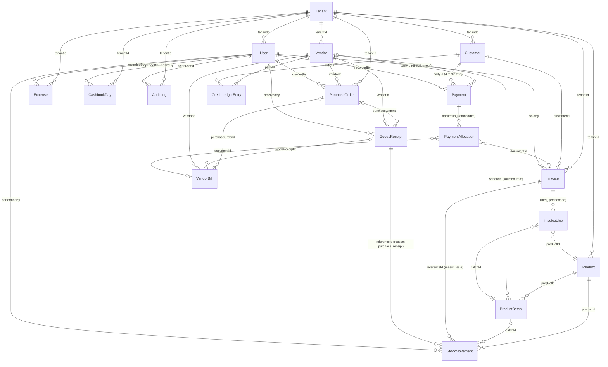
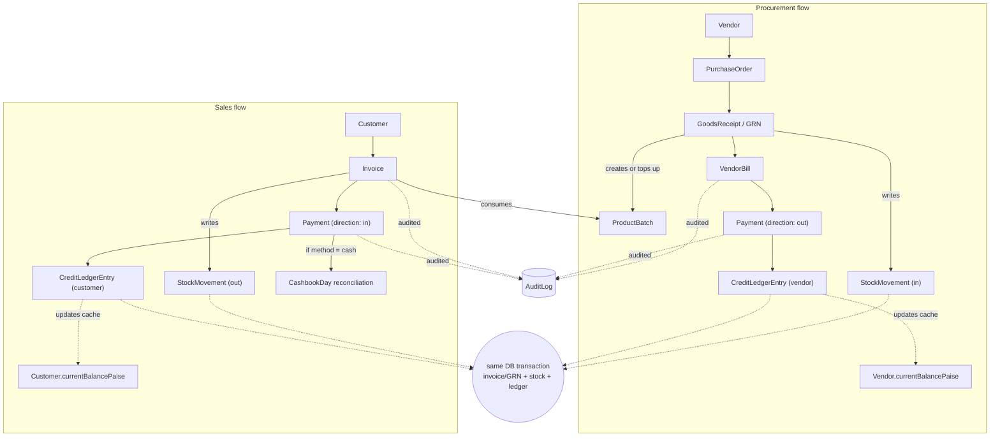

# Database Structure

**Engine:** MongoDB (Atlas, `mongodb+srv://`) via Mongoose 8, replica set required (multi-document transactions).
**Multi-tenancy model:** single shared database, every document scoped by a plain `tenantId: string` field (never an ObjectId ref — tenant isolation is a query filter, not a populate-able relationship). `Tenant` is the only collection with no `tenantId` of its own.
**Money:** every currency field is an **integer number of paise** (`*Paise`), never a float. No decimal library is installed in this repo, so integer-minor-units is the dependency-free way to avoid float rounding bugs in a financial system (the same convention Stripe etc. use). The client-side POS cart (`apps/web/src/features/billing/hooks/useCartStore.ts`) still holds rupee floats — that's pre-persistence UI state; converting to paise happens wherever an `Invoice` is finally written.
**Numbering:** business-visible document numbers (`invoiceNumber`, `poNumber`, `grnNumber`, `billNumber`) are generated by `nextSequence(tenantId, name)` in [apps/api/src/shared/sequence/sequence.service.ts](apps/api/src/shared/sequence/sequence.service.ts), backed by an atomic `$inc` on a per-tenant `Counter` document — safe under concurrent requests, unlike a read-then-write counter.

> **A note on how far this document goes.** The technical design doc this repo is built against (`AgriDealer_ERP_Technical_Design_Document.docx`, referenced throughout the code as `docs §X.Y`) is not present in this repository. Everything below is the **data layer only** — schemas, fields, indexes, and relationships — inferred carefully from the permission matrix, route-stub comments, and the existing Phase 0 code. It deliberately stops short of business logic that depends on rules only that missing document would settle: GST/discount calculation, payment allocation order (FIFO vs. oldest-first), batch consumption order (FIFO by expiry), credit-ageing buckets, and cashbook reconciliation math. See [What's intentionally not built yet](#whats-intentionally-not-built-yet) below.

---

## Relationship diagram

`||--o{` = required FK (one parent, many children); `|o--o{` = optional FK; `}o--||` = embedded-array line item pointing at its parent document. `tenantId` edges are drawn because they're the real ownership relationship in this schema even though, per the note above, they're implemented as a string filter rather than a Mongo ref.

## Business flow diagram

The dashed lines into the transaction bubble aren't a data relationship — they mark the writes that a real service must perform atomically (`mongoose.startSession()` + `withTransaction`), which is exactly why [apps/api/src/config/db.ts](apps/api/src/config/db.ts) requires a replica set. An invoice must never be saved with stock or the credit ledger left unupdated, and vice versa.

---

## Existing collections (Phase 0)

### `tenants`

Model: [apps/api/src/modules/tenants/tenants.model.ts](apps/api/src/modules/tenants/tenants.model.ts). One document per dealer shop — the root of tenant isolation.

| Field | Type | Notes |
|---|---|---|
| `_id` | ObjectId | referenced elsewhere as `tenantId` (string) |
| `name` | string | required |
| `status` | enum: `active`, `suspended`, `trial` | default `trial` |
| `plan` | string | required, default `starter` |
| `features` | string[] | default `[]` |
| `timezone` | string | required, default `Asia/Kolkata` |
| `createdAt` / `updatedAt` | Date | |

### `users`

Model: [apps/api/src/modules/users/users.model.ts](apps/api/src/modules/users/users.model.ts). Staff accounts.

| Field | Type | Notes |
|---|---|---|
| `tenantId` | string | required |
| `name`, `email`, `passwordHash` | string | required; email lowercased/trimmed |
| `role` | enum: `owner`, `manager`, `sales`, `accountant`, `warehouse` | required |
| `status` | enum: `active`, `disabled` | default `active` |
| `tokenVersion` | number | bumped to revoke outstanding JWTs |
| `mfaEnabled` / `mfaSecret` | boolean / string | `mfaSecret` is `select: false`; flagged in code as needing field-level encryption in production |

**Index:** `{tenantId, email}` unique — email is unique per tenant, not globally.

### `auditlogs`

Model: [apps/api/src/modules/audit/audit.model.ts](apps/api/src/modules/audit/audit.model.ts). Append-only, no update/delete path by design. Written by [AuditService](apps/api/src/shared/audit/AuditService.ts), typically in the same transaction as the change it records.

| Field | Type | Notes |
|---|---|---|
| `tenantId` | string | indexed |
| `actor.userId/name/role` | string | required |
| `action` | string | required |
| `entity.type/id` | string | required |
| `before` / `after` | Mixed | optional entity snapshots |
| `context.ip/userAgent/requestId` | string | `requestId` required |
| `performedAt` | Date | default now |

**Index:** `{tenantId, performedAt: -1}`.

---

## New collections

### Products — `apps/api/src/modules/products/`

**`products`** ([product.model.ts](apps/api/src/modules/products/product.model.ts)) — catalogue item.

| Field | Type | Notes |
|---|---|---|
| `tenantId` | string | required |
| `sku`, `name`, `category` | string | required |
| `unit` | enum: `kg`,`litre`,`bag`,`piece`,`box` | required |
| `hsnCode` | string | required — Indian GST HSN code |
| `gstRatePercent` | number (0–28) | required |
| `brand`, `description` | string | optional |
| `batchTracked` | boolean | default `true` — most agrochemicals/seed carry expiry |
| `reorderLevel` | number | default 0 |
| `status` | enum: `active`, `discontinued` | default `active` |

**Indexes:** `{tenantId, sku}` unique; `{tenantId, name}`; `{tenantId, status}`.

**`productbatches`** ([productBatch.model.ts](apps/api/src/modules/products/productBatch.model.ts)) — a received lot, own cost/MRP/expiry.

| Field | Type | Notes |
|---|---|---|
| `productId` | ref → Product | required |
| `batchNumber` | string | required |
| `mfgDate`, `expiryDate` | Date | optional |
| `purchasePricePaise`, `mrpPaise` | number | required |
| `quantityReceived`, `quantityAvailable` | number | `quantityAvailable` is a **denormalized cache** — source of truth is the sum of `StockMovement` rows for this batch; only ever changed alongside a `StockMovement` write in the same transaction |
| `vendorId` | ref → Vendor | optional |
| `status` | enum: `active`, `expired`, `exhausted` | default `active` |

**Indexes:** `{tenantId, productId, batchNumber}` unique; `{tenantId, expiryDate}` (expiry alerts); `{tenantId, productId, status}`.

### Inventory — `apps/api/src/modules/inventory/`

**`stockmovements`** ([stockMovement.model.ts](apps/api/src/modules/inventory/stockMovement.model.ts)) — append-only stock ledger, same immutability pattern as `AuditLog`.

| Field | Type | Notes |
|---|---|---|
| `productId` | ref → Product | required |
| `batchId` | ref → ProductBatch | optional (non-batch-tracked products) |
| `direction` | enum: `in`, `out` | required |
| `quantity` | number | required, ≥0 |
| `reason` | enum: `purchase_receipt`,`sale`,`sale_return`,`purchase_return`,`adjustment`,`transfer` | required |
| `unitCostPaise` | number | required |
| `referenceType` / `referenceId` | enum(`PurchaseOrder`,`GoodsReceipt`,`Invoice`) / dynamic ref | optional — omitted for freeform manual adjustments, which have no source document |
| `performedBy` | ref → User | required |
| `performedAt` | Date | default now |

**Indexes:** `{tenantId, productId, performedAt:-1}`; `{tenantId, batchId}`; `{tenantId, referenceType, referenceId}`.

### Customers — `apps/api/src/modules/customers/`

**`customers`** ([customer.model.ts](apps/api/src/modules/customers/customer.model.ts))

| Field | Type | Notes |
|---|---|---|
| `name`, `phone` | string | required |
| `email`, `gstin` | string | optional |
| `address` | subdocument (`shared/schemas/address.schema.ts`) | optional — line1/line2/city/state/pincode |
| `creditLimitPaise`, `creditDays` | number | default 0 |
| `currentBalancePaise` | number | denormalized cache of `CreditLedgerEntry`; positive = customer owes the dealer |
| `status` | enum: `active`, `inactive` | default `active` |

**Index:** `{tenantId, phone}` unique.

### Purchases — `apps/api/src/modules/purchases/`

**`vendors`** ([vendor.model.ts](apps/api/src/modules/purchases/vendor.model.ts)) — mirrors `Customer`; `currentBalancePaise` positive = dealer owes vendor. Index: `{tenantId, phone}`, `{tenantId, name}`.

**`purchaseorders`** ([purchaseOrder.model.ts](apps/api/src/modules/purchases/purchaseOrder.model.ts)) — the intent to buy.

| Field | Type | Notes |
|---|---|---|
| `poNumber` | string | required, unique per tenant |
| `vendorId` | ref → Vendor | required |
| `lines[]` | `{productId→Product, quantity, unitCostPaise}` | ≥1 line |
| `status` | enum: `draft`,`ordered`,`partially_received`,`received`,`cancelled` | default `draft` |
| `expectedDate` | Date | optional |
| `createdBy` | ref → User | required |

**`goodsreceipts`** ([goodsReceipt.model.ts](apps/api/src/modules/purchases/goodsReceipt.model.ts)) — the physical receiving event (GRN). Distinct from `PurchaseOrder` (intent) and `VendorBill` (financial claim) — recording one is what creates/tops-up `ProductBatch` rows and writes `StockMovement(in)`.

| Field | Type | Notes |
|---|---|---|
| `grnNumber` | string | required, unique per tenant |
| `purchaseOrderId` | ref → PurchaseOrder | optional — goods can be received without a PO |
| `vendorId` | ref → Vendor | required |
| `lines[]` | `{productId→Product, batchNumber, mfgDate?, expiryDate?, quantity, unitCostPaise, mrpPaise}` | ≥1 line |
| `receivedBy` | ref → User | required |
| `receivedAt` | Date | default now |

**`vendorbills`** ([vendorBill.model.ts](apps/api/src/modules/purchases/vendorBill.model.ts)) — the vendor's own invoice against us.

| Field | Type | Notes |
|---|---|---|
| `billNumber` | string | vendor's invoice number |
| `vendorId` | ref → Vendor | required |
| `purchaseOrderId`, `goodsReceiptId` | ref | optional |
| `lines[]` | `{productId, quantity, unitCostPaise, taxRatePercent, taxAmountPaise, lineTotalPaise}` | ≥1 line |
| `subtotalPaise`, `taxTotalPaise`, `grandTotalPaise`, `amountPaidPaise` | number | |
| `dueDate` | Date | optional |
| `status` | enum: `unpaid`,`partially_paid`,`paid`,`cancelled` | default `unpaid` |

**Index:** `{tenantId, vendorId, billNumber}` unique.

### Billing — `apps/api/src/modules/billing/`

**`invoices`** ([invoice.model.ts](apps/api/src/modules/billing/invoice.model.ts)) — the sales invoice / POS bill. Line shape mirrors the existing client cart (`useCartStore.ts`: `productId, productName, quantity, unitPrice, discountAmount`) — a future billing service converts that cart (rupee floats) into this record (paise integers) on finalize.

| Field | Type | Notes |
|---|---|---|
| `invoiceNumber` | string | required, unique per tenant |
| `customerId` | ref → Customer | optional — walk-in/cash sale allowed |
| `lines[]` | `{productId→Product, batchId→ProductBatch?, productName (snapshot), quantity, unitPricePaise, discountPaise, taxRatePercent, taxAmountPaise, lineTotalPaise}` | ≥1 line; `productName` frozen at sale time so the invoice never changes retroactively if the catalogue does |
| `subtotalPaise`, `discountTotalPaise`, `taxTotalPaise`, `grandTotalPaise`, `amountPaidPaise` | number | |
| `paymentStatus` | enum: `unpaid`,`partially_paid`,`paid` | default `unpaid` |
| `status` | enum: `draft`,`held`,`finalized`,`cancelled` | default `draft` |
| `soldBy` | ref → User | required |

**Indexes:** `{tenantId, invoiceNumber}` unique; `{tenantId, customerId}`; `{tenantId, createdAt:-1}`; `{tenantId, status}`.

### Credit — `apps/api/src/modules/credit/`

**`payments`** ([payment.model.ts](apps/api/src/modules/credit/payment.model.ts)) — a single money movement, either direction.

| Field | Type | Notes |
|---|---|---|
| `direction` | enum: `in`, `out` | `in` = customer receipt, `out` = vendor payment |
| `partyType` | enum: `customer`, `vendor` | |
| `partyModel` | enum: `Customer`, `Vendor` | mirrors `partyType`; lets Mongoose `refPath` resolve the polymorphic `partyId` |
| `partyId` | dynamic ref (`refPath: partyModel`) | required |
| `amountPaise` | number | required |
| `method` | enum: `cash`,`upi`,`card`,`bank_transfer`,`cheque` | required |
| `referenceNumber` | string | optional |
| `appliedTo[]` | `{documentType: 'Invoice'\|'VendorBill', documentId (dynamic ref), amountPaise}` | how the payment is allocated across open documents |
| `recordedBy` | ref → User | required |

**`creditledgerentries`** ([creditLedger.model.ts](apps/api/src/modules/credit/creditLedger.model.ts)) — append-only running balance per party, same immutability pattern as `AuditLog`/`StockMovement`.

| Field | Type | Notes |
|---|---|---|
| `partyType` / `partyModel` / `partyId` | — | same polymorphic shape as `Payment` |
| `entryType` | enum: `invoice`,`payment`,`vendor_bill`,`opening_balance`,`adjustment` | |
| `referenceType` / `referenceId` | optional | points at the `Invoice`/`VendorBill`/`Payment` that caused this entry |
| `debitPaise`, `creditPaise`, `balanceAfterPaise` | number | |
| `performedAt` | Date | default now |

**Index:** `{tenantId, partyType, partyId, performedAt:-1}`.

### Expenses — `apps/api/src/modules/expenses/`

**`expenses`** ([expense.model.ts](apps/api/src/modules/expenses/expense.model.ts))

| Field | Type | Notes |
|---|---|---|
| `category` | enum: `rent`,`salary`,`utilities`,`transport`,`maintenance`,`marketing`,`misc` | required |
| `amountPaise` | number | required |
| `description` | string | optional |
| `paymentMethod` | enum: `cash`,`upi`,`bank_transfer`,`cheque` | required |
| `expenseDate` | Date | required |
| `recordedBy` | ref → User | required |
| `attachmentUrl` | string | optional — receipt image/PDF in S3/MinIO |

**Indexes:** `{tenantId, expenseDate:-1}`; `{tenantId, category}`.

### Cashbook — `apps/api/src/modules/cashbook/`

**`cashbookdays`** ([cashbookDay.model.ts](apps/api/src/modules/cashbook/cashbookDay.model.ts)) — one document per tenant per calendar day; day open/close/reconciliation. Does **not** duplicate individual cash movements — those already exist as `Payment(method: cash)`, `Expense(paymentMethod: cash)`, and cash `Invoice` rows for the date.

| Field | Type | Notes |
|---|---|---|
| `date` | Date | required |
| `openingBalancePaise` | number | required |
| `closingBalancePaise` | number | optional — what staff physically counted at close |
| `systemComputedClosingPaise` | number | optional — what a reconciliation service derives from that day's cash `Payment`/`Expense`/`Invoice` rows; the gap vs. `closingBalancePaise` is the reconciliation variance |
| `status` | enum: `open`, `closed` | default `open` |
| `openedBy` / `closedBy` | ref → User | |
| `openedAt` / `closedAt` | Date | |
| `reconciliationNotes` | string | optional |

**Index:** `{tenantId, date}` unique.

### Shared sequence helper — `apps/api/src/shared/sequence/`

**`counters`** ([counter.model.ts](apps/api/src/shared/sequence/counter.model.ts)) — not a business entity, backing store for [`nextSequence()`](apps/api/src/shared/sequence/sequence.service.ts).

| Field | Type | Notes |
|---|---|---|
| `tenantId`, `name` | string | e.g. `name: 'invoice'` |
| `seq` | number | incremented atomically via `$inc` |

**Index:** `{tenantId, name}` unique.

---

## Roles & Permissions

Unchanged from Phase 0 — [packages/contracts/src/auth/roles.ts](packages/contracts/src/auth/roles.ts). Not a collection; a static matrix shared by frontend and backend so they can't drift.

| Role | Permissions |
|---|---|
| `owner` | all permissions |
| `manager` | everything except `expenses:manage`, `users:manage`, `audit:view` (has `expenses:view` instead) |
| `sales` | `billing:create`, `customers:create`, `reports:view` |
| `accountant` | `reports:profit`, `reports:view`, `payments:record`, `expenses:manage`, `cashbook:close` |
| `warehouse` | `reports:view`, `inventory:receive`, `inventory:adjust`, `purchases:receive` |

The backend `authorize()` middleware ([apps/api/src/middleware/authorize.ts](apps/api/src/middleware/authorize.ts)) is the actual enforcement point; the frontend check is a UI affordance only.

---

## What's intentionally not built yet

The models above are the full data layer, but **no service/controller/route exists for any of the new collections** — none of this is reachable over HTTP yet. Specifically still missing, and requiring real business rules this repo doesn't have documented anywhere:

- **Invoice/VendorBill total calculation** — exact GST computation order, how discounts stack, rounding rule.
- **Payment allocation** — when a payment is less than the outstanding balance, which open `Invoice`/`VendorBill` it's applied to first (oldest-first? largest-first?).
- **Batch consumption order** — FIFO by expiry is the obvious default for perishable agrochemicals, but not confirmed.
- **Credit ageing** — bucket boundaries (30/60/90 days?) for the "Ledger and ageing" view referenced in `apps/web/src/routes/_app/credit/index.tsx`.
- **Cashbook reconciliation** — the exact formula for `systemComputedClosingPaise` and what variance is auto-flagged vs. requires a note.
- **Transaction orchestration** — the actual `mongoose.startSession()`/`withTransaction()` wiring that keeps e.g. an `Invoice` write, its `StockMovement`s, and its `CreditLedgerEntry` atomic.

Building these now would mean guessing financial logic for a production system — riskier than leaving the seam (a repository per model, ready for a service to sit on top) visible and documented. This list should be the first thing checked against the real `AgriDealer_ERP_Technical_Design_Document.docx` once it's available.

---

## Cross-cutting notes

- **Tenant isolation** is enforced at the query layer, not by separate databases — every repository takes a `TenantContext` and appends `tenantId` to every filter (see `apps/api/src/shared/types/tenantContext.ts`, following the pattern first established in `users.repository.ts`). No service or controller is meant to query a model directly.
- **Transactions**: `config/db.ts` requires a replica set specifically so a write like "invoice + stock + ledger" can be one atomic operation instead of three independent ones that could partially fail.
- **Immutability**: `AuditLog`, `StockMovement`, and `CreditLedgerEntry` are all append-only by construction — their repositories expose no update/delete method. Corrections are new offsetting rows, never edits of history.
- **Denormalized balance caches** (`ProductBatch.quantityAvailable`, `Customer/Vendor.currentBalancePaise`, `CashbookDay.systemComputedClosingPaise`) all have one rule: they may only change in the same transaction as the ledger row (`StockMovement`/`CreditLedgerEntry`) that justifies the change.
- **JWT claims** (`AccessTokenClaims`) carry `userId`, `tenantId`, `role`, `tokenVersion` — `tokenVersion` is checked against `users.tokenVersion` to allow server-side session invalidation.
